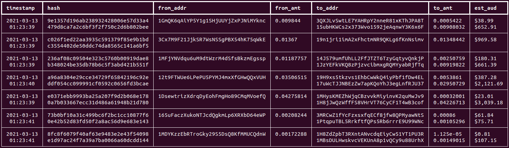

# peek

A simple command-line program to peek into real-time unconfirmed Bitcoin transactions using Blockchain.com's Bitcoin WebSocket API. It is a work in progress.

## Demo



## Overview

From Satoshi Nakamoto's [**Bitcoin Whitepaper**](https://www.bitcoin.com/bitcoin.pdf),
> We define an electronic coin as a chain of digital signatures. Each owner transfers the coin to the next by digitally signing a hash of the previous transaction and the public key of the next owner and adding these to the end of the coin. A payee can verify the signatures to verify the chain of ownership.

### Blockchain

A block in the chain contains many transactions. Pairs of transaction IDs (TXIDs) are hashed and pairs of hashes are hashed again, and again, until a single hash remains - the [**merkle root**](https://learnmeabitcoin.com/technical/merkle-root), which is stored in a block's header.

Each block also stores a hash of the previous block's header, creating a chain. This enforces immutable transactions.

### Transactions


A transaction consists of one or more **inputs** and one or more **outputs**. When you spend your coins, you are actually spending an unspent transaction output (UTXO) that you own. An output is considered unspent if it is not referenced as an input for any other transaction. Your "wallet balance" is actually determined by your UTXOs and your unconfirmed transactions in the [**mempool**](https://learnmeabitcoin.com/technical/memory-pool).

There is no way to split a UTXO, so if you have a 5 BTC UTXO and want to spend 2 BTC, then you actually spend all 5 BTCs and **two** new UTXOs are created - one worth 2 BTC which is paid to the receiver, and one worth 3 BTC which is paid back to you as change. This is why there are often two or more `to_addr` for one transaction in `peek`.

[**Coinbase transactions**](https://learnmeabitcoin.com/technical/coinbase-transaction) are an exception to some of these rules. A coinbase is a mining reward whereby miners receive Bitcoin as a reward for mining. Mining is simply a process where miners verify the legitimacy of a transaction. The first transaction in each block is the coinbase transaction.

## More

[**Blockchain.com**](https://www.blockchain.com/explorer) supports blockchain exploring and can be used to view certain blocks, transactions and more.

To view more details of a specific transaction, copy its `hash` and go to **blockchain.com/btc/tx/\<hash>**. eg. for a `hash=5f278439303d87f7324543a3e873ffd01a18b45bd61476d223341667007680e1` go to [https://www.blockchain.com/btc/tx/5f278439303d87f7324543a3e873ffd01a18b45bd61476d223341667007680e1](https://www.blockchain.com/btc/tx/5f278439303d87f7324543a3e873ffd01a18b45bd61476d223341667007680e1)

## Running

```bash
git clone https://github.com/qlyde/peek.git
cd peek
pip3 install -r requirements.txt
python3 main.py
```

## TODO

- [ ] Add option to only print `n` transactions
- [ ] Add option to keep alive for `n` seconds
- [ ] Add option to filter for transactions over $N
- [ ] Add colour to indicate transaction size
